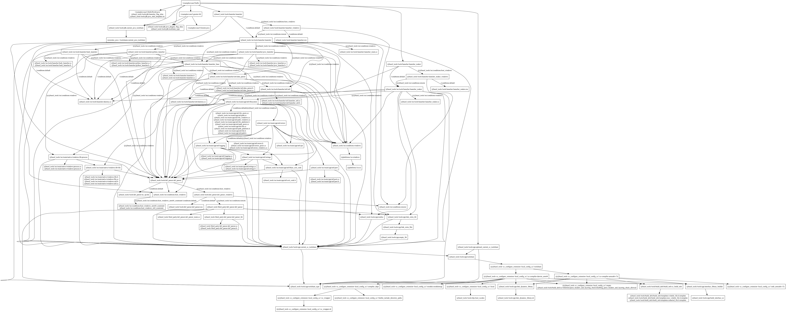
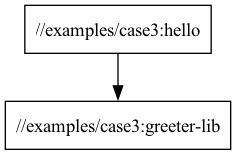

# Case 2: My first Java executable

## About the case

This case uses the native java_binary and java_library rules. 
The java_library rule compiles and links sources into a .jar file 
The java_binary rule builds a jar file, plus a wrapper shell script.
See bazel-bin/examples/case3/hello.runfiles/_main/examples/case3/hello for the wrapper script.

## Additional things to try out

bazel query "deps(//examples/case3:hello)"

vs

bazel query "deps('//examples/case3:hello') intersect //..."

