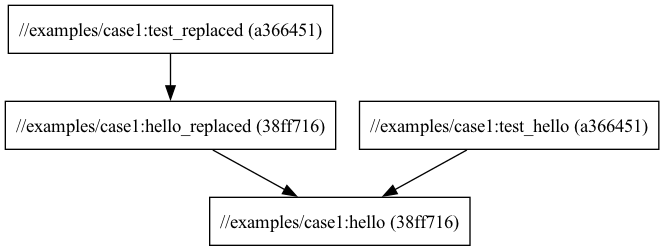

# Case 1

## About the case

`genrule` is a generic Bazel rule that lets you execute shell commands.

The given example shows how to create a simple `genrule` that prints "Hello, World!" to a file.

It also shows how to consume a file produced by another target.

```
bazel build //examples/case1:hello
cat bazel-bin/examples/case1/hello.txt

bazel build //examples/case1:hello_replaced
cat bazel-bin/examples/case1/replaced.txt
```

## Additional things to try out

One of Bazels strengths is the query language on the build graph.

To see dependencies for the `hello_replaced` target, run:
`bazel query 'deps(//examples/case1:hello_replaced)'`

To see which targets depend on the `hello` target, run:
`bazel query 'rdeps(//..., //examples/case1:hello)'`


