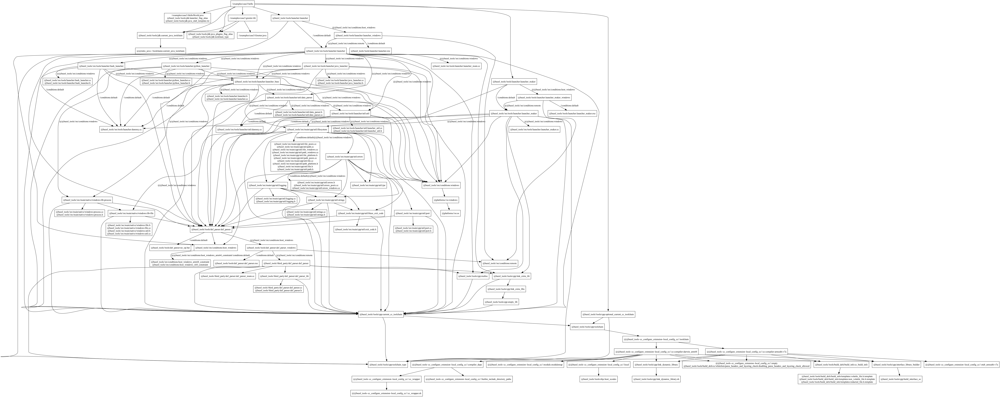
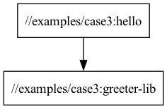

# Case 2: Hello, Java!

## About the case

This case uses the native java_binary and java_library rules. 
The java_library rule compiles and links sources into a .jar file 
The java_binary rule builds a jar file, plus a wrapper shell script.
See bazel-bin/workshop/case2/hello.runfiles/_main/workshop/case2/hello for the wrapper script.

This is also the first example that uses external depencencies from Maven, for example
`@maven//:org_assertj_assertj_core` which is a dependency for the `greeter-test` test-target.

All dependencies are resolved using the `MODULE.bazel` and the `maven_install.json` lockfile.
This generates the `@maven//` namespace and the Starlark-targets for the dependencies.

## Things to try out
### Build the lib
`bazel build //workshop/case2:greeter-lib` - builds the greeter-lib target and outputs the location for the resulting jar file.

### Run the binary
`bazel run //workshop/case2:hello` - runs the hello target, which depends on the greeter-lib target and outputs the result.

### Modifying the different parts, and see what recompiles
If you modify the `Greeter.java` file and run `bazel run //workshop/case2:hello`, the `greeter-lib` target will recompile and then the `hello` will rebuild before executing.

If you modify the `HelloWorld.java` file and then run `bazel run //workshop/case2:hello`, the `hello` target will recompile.

You can see how many processes were needed before the build was complete by looking at the output:
```
bazel run //workshop/case2:hello
INFO: Invocation ID: 1ca27de2-08e0-4ff0-93b9-a83b6f518f70
INFO: Analyzed target //workshop/case2:hello (0 packages loaded, 0 targets configured).
INFO: Found 1 target...
Target //workshop/case2:hello up-to-date:
  bazel-bin/workshop/case2/hello
  bazel-bin/workshop/case2/hello.jar
INFO: Elapsed time: 0.712s, Critical Path: 0.56s
INFO: 2 processes: 1 internal, 1 worker.
INFO: Build completed successfully, 2 total actions
INFO: Running command line: bazel-bin/workshop/case2/hello
Hello, World!
```

Here you can see the line `INFO: 2 processes: 1 internal, 1 worker.` which shows that 2 processes were used to build the target.

If you run it again without modifying anything, you will see that the target is up-to-date and only 1 process are used:
```
INFO: 1 process: 1 internal.
```

## Additional things to try out

### Updating maven dependencies
Maven dependencies are resolved using the WORKSPACE file and the maven_install.json file. 
Update the WORKSPACE.bazel file with new versions and run `bazel run @maven//:pin` to update the maven_install.json file.


### Query Bazel for the dependency graph of the hello target:
`bazel query "deps(//workshop/case2:hello)"`



vs

`bazel query "deps('//workshop/case2:hello') intersect //..."`



### Show files generated by a target:
`bazel cquery //workshop/case2:hello --output=files`

### Create another library and consume it in the `hello` target
